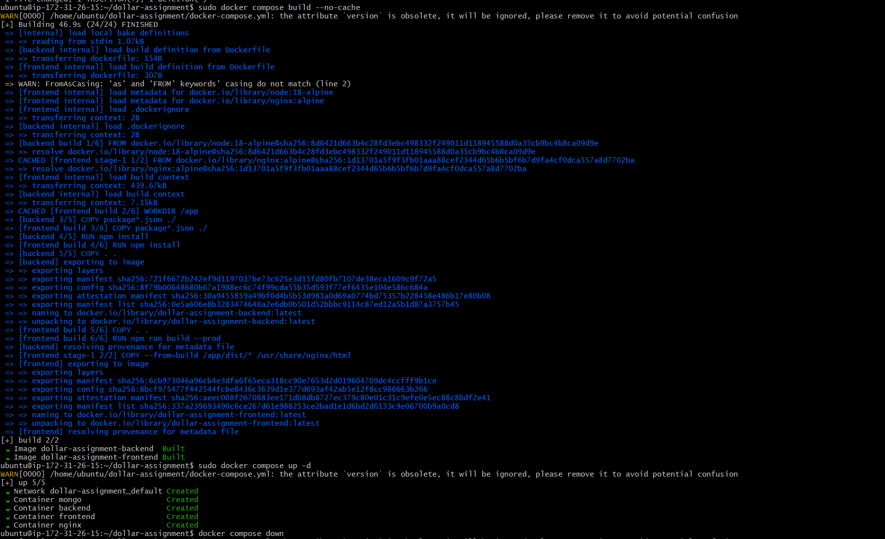
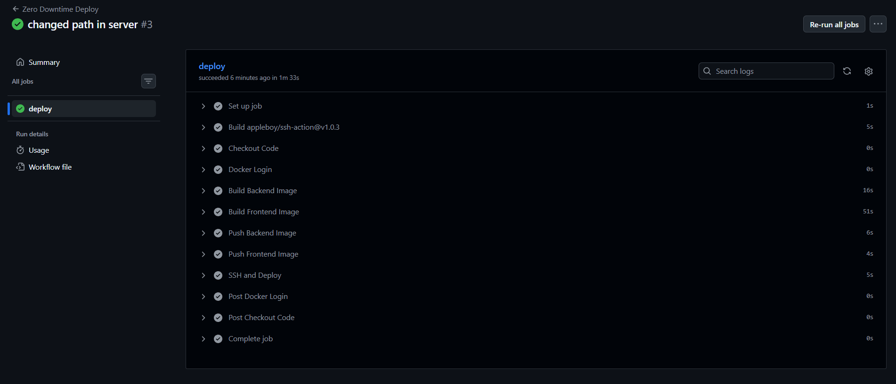
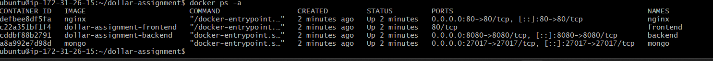
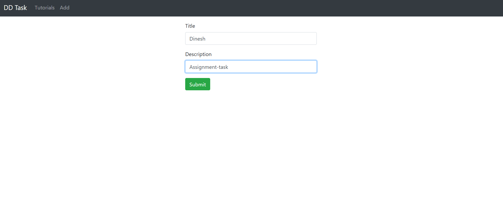
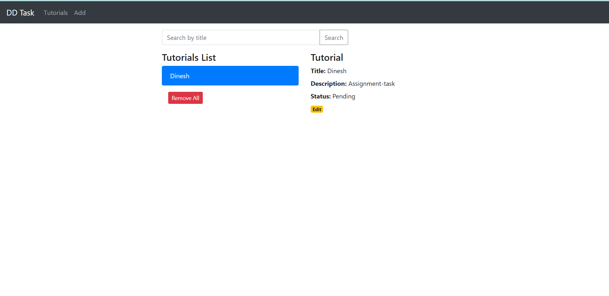
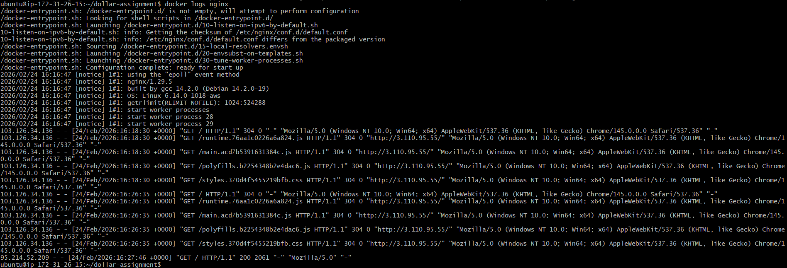

# MEAN Stack Deployment using Docker, Nginx & GitHub Actions CI/CD

---

## Project Overview

This project demonstrates the **Zero Downtime Deployment** of a full-stack MEAN (MongoDB, Express, Angular, Node.js) application using:

* Docker & Docker Compose
* Nginx Reverse Proxy
* GitHub Actions CI/CD
* Cloud-based Ubuntu Server

The CI/CD pipeline automates:

* Building Docker images
* Pushing images to DockerHub
* Pulling images to the server
* Recreating containers without downtime

---

## Project Architecture

```
GitHub Push → GitHub Actions → DockerHub
                    ↓
              Cloud Server (Ubuntu)
                    ↓
        Docker Compose + Nginx
                    ↓
               Running App
```

---

## Project Structure

```
assignment-repo/
│
├── backend/
│   └── Dockerfile
│
├── frontend/
│   └── Dockerfile
│
├── nginx/
│   └── nginx.conf
│
├── docker-compose.yml
└── .github/workflows/deploy.yml
```

---

# Docker Configuration

---

## Backend Dockerfile

```dockerfile
FROM node:18

WORKDIR /app

COPY package*.json ./

RUN npm install

COPY . .

EXPOSE 5000

CMD ["npm", "start"]
```

---

## Frontend Dockerfile

```dockerfile
FROM nginx:alpine

COPY dist/frontend /usr/share/nginx/html

EXPOSE 80
```

---

# Docker Compose Configuration

---

## docker-compose.yml

```yaml
services:

  mongo:
    image: mongo
    container_name: mongo
    volumes:
      - mongo-data:/data/db

  backend:
    image: 756958/backend:latest
    container_name: backend
    depends_on:
      - mongo

  frontend:
    image: 756958/frontend:latest
    container_name: frontend
    depends_on:
      - backend

  nginx:
    image: nginx
    container_name: nginx
    ports:
      - "80:80"
    depends_on:
      - frontend

volumes:
  mongo-data:
```

---

# Nginx Configuration

---

## nginx.conf

```nginx
server {
    listen 80;

    location / {
        proxy_pass http://frontend;
    }

    location /api {
        proxy_pass http://backend:5000;
    }
}
```

---

# CI/CD Configuration

---

## GitHub Actions Workflow

Path:

```
.github/workflows/deploy.yml
```

```yaml
name: CI/CD Pipeline

on:
  push:
    branches:
      - main

jobs:
  deploy:
    runs-on: ubuntu-latest

    steps:
      - name: Checkout Code
        uses: actions/checkout@v3

      - name: Docker Login
        uses: docker/login-action@v2
        with:
          username: ${{ secrets.DOCKER_USERNAME }}
          password: ${{ secrets.DOCKER_PASSWORD }}

      - name: Build Backend Image
        run: docker build -t 756958/backend:latest ./backend

      - name: Build Frontend Image
        run: docker build -t 756958/frontend:latest ./frontend

      - name: Push Backend Image
        run: docker push 756958/backend:latest

      - name: Push Frontend Image
        run: docker push 756958/frontend:latest

      - name: SSH and Deploy
        uses: appleboy/ssh-action@v1.0.3
        with:
          host: ${{ secrets.HOST }}
          username: ${{ secrets.USERNAME }}
          key: ${{ secrets.SSH_KEY }}
          script: |
            cd /home/ubuntu/assignment-repo
            docker compose pull
            docker compose up -d --no-deps


---

# Server Setup Instructions

---

## Step 1: Install Docker

```bash
sudo apt update
sudo apt install docker.io -y
```

---

## Step 2: Add User to Docker Group

```bash
sudo usermod -aG docker ubuntu
newgrp docker
```

---

## Step 3: Clone Repository

```bash
git clone https://github.com/your-username/assignment-repo.git
cd assignment-repo
```

---

## Step 4: Run Application

```bash
docker compose up -d
```

---
Image while composing time ..



---

## 1. GitHub Actions CI/CD Execution



## 2. DockerHub Images


---

## 3. Running Containers

```bash
docker ps
```


---

## 4. Application UI in Browser

Visit:

```
http://3.110.95.55/

```



---

## 5. Nginx Infrastructure

```bash
docker logs nginx
```



---

# Zero Downtime Strategy

* MongoDB container is never restarted
* Backend & Frontend containers are force recreated
* Nginx remains active
* Old containers are pruned automatically

Ensuring uninterrupted application availability.

---